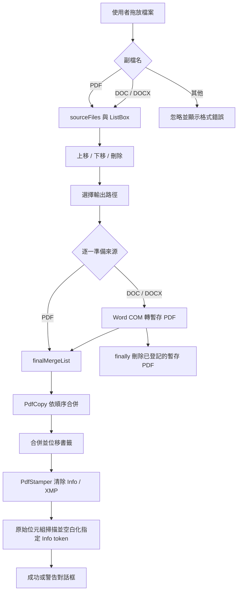

# PDF Merger 完整程式文件

## 1. 文件範圍與版本基準

本文件描述工作區目前可見的 C# 原始碼，不把舊版備份或已發佈 EXE 混入現況：

| 類型 | 檔案 | 角色 |
|---|---|---|
| 方案 | `Pdf_Merger.sln` | Visual Studio 方案入口 |
| 專案 | `Pdf_Merger.csproj` | .NET、WinForms、相依套件與發佈設定 |
| 啟動 | `Program.cs` | 初始化 WinForms 並建立 `Form1` |
| 主程式 | `Form1.cs` | UI 事件、檔案清單、Word 轉檔、PDF 合併、中繼資料清除 |
| UI 定義 | `Form1.Designer.cs` | 視窗與控制項位置、尺寸、文字、事件綁定 |
| 記錄 | `Logger.cs` | 將資訊與例外附加寫入文字檔 |
| 圖示 | `Resources/pdfMeld.ico` | 嵌入式應用程式圖示 |
| 歷史材料 | `After`、`Form1.cs.copy` | 舊實作／備份，不參與目前編譯 |
| 測試材料 | `Test/` | 既有 PDF 與合併輸出，尚無自動測試專案 |

基準日期為 2026-09-24。目前 Git 儲存庫沒有任何 commit，工作區檔案均為 untracked，因此無法用 commit hash 標示文件版本。

## 2. 程式目的

PDF Merger 是 Windows 桌面工具。使用者把 PDF、DOC 或 DOCX 拖入清單，調整順序、刪除不需要的項目，再輸出單一 PDF。

核心目標：

1. 全程本機處理，不上傳檔案。
2. PDF 依 UI 清單順序合併。
3. DOC/DOCX 先由本機 Microsoft Word 轉成暫存 PDF。
4. 合併來源書籤並修正頁碼位移。
5. 透過 `PdfCopy` 複製頁面與頁面註解，意圖保留超連結。
6. 合併後嘗試清除標準文件中繼資料與 XMP。
7. 把操作與例外寫入 `PDF_Merger_Error_Log.txt`。

「全程本機處理」描述的是產品本身：目前原始碼沒有 HTTP client、遙測或上傳流程。測試 Agent 可以另外從網路**單向下載**公開測試 PDF，但不得把本機來源、合併輸出、截圖、日誌、檔名、路徑、內容片段或其衍生搜尋詞傳到外部；測試分析與 PDF 驗證仍須在本機完成。

## 3. 技術堆疊與執行條件

| 項目 | 目前設定 |
|---|---|
| UI | Windows Forms |
| 語言／執行環境 | C#、.NET 6、`net6.0-windows` |
| 目標平台 | `win-x64` |
| PDF 引擎 | iTextSharp 5.5.13.4 |
| 記錄套件 | Microsoft.Extensions.Logging 8.0.0 與 Abstractions 8.0.0；目前程式未實際呼叫這兩個套件，而是使用自製 `Logger` |
| 發佈 | Self-contained、single-file、未 trimming |
| Word 轉換 | Microsoft Word COM Automation，需安裝可自動化的桌面版 Word |
| 應用圖示 | `Resources/pdfMeld.ico`，同時設定為 ApplicationIcon 與 EmbeddedResource |

專案檔註解提供的發佈方式：

```powershell
dotnet publish -c Release -r win-x64 --self-contained -p:PublishSingleFile=true -p:EnableCompressionInSingleFile=true
```

### 3.1 目前建置基線

2026-09-24 執行：

```powershell
dotnet build .\Pdf_Merger.sln --no-restore
```

結果為失敗，原因是本機尚未下載 `Microsoft.NETCore.App.Runtime.win-x64` 與 `Microsoft.WindowsDesktop.App.Runtime.win-x64` 6.0.36 runtime packs。另出現 `NU1701`：iTextSharp 5.5.13.4 以 .NET Framework 相容資產還原，與 `net6.0-windows7.0` 不保證完全相容。這是環境／相依性基線，不等於原始碼一定無法建置；需先完成 `dotnet restore -r win-x64` 再驗證。

## 4. 整體架構與資料流



這是單一表單、單一 UI 執行緒的同步架構。合併與 Word 轉檔都在 UI 執行緒上執行，僅在開始前呼叫一次 `Application.DoEvents()`。

## 5. UI 規格

主視窗標題為 `PDF Merger`，固定初始內容區 390 × 450，啟動時置中。程式未設定固定邊框、最小尺寸、錨點或 Dock，因此使用者調整視窗大小時，控制項不會跟著重新配置。

| 控制項 | 位置／尺寸 | 行為 |
|---|---|---|
| `labelInfo` | (10,15)／250×25 | 顯示 `Add DOC, DOCX, or PDF files` |
| `btnDisclaimer` | (300,12)／80×32 | 開啟 About & License 視窗 |
| `listBox` | (10,55)／373×350 | 接受拖放、允許多選、owner draw、列高 28 |
| `btnMoveUp` | (10,400)／50×40 | 單一選取項目上移 |
| `btnMoveDown` | (65,400)／50×40 | 單一選取項目下移 |
| `btnDelete` | (120,400)／60×40 | 刪除全部選取項目 |
| `btnMerge` | (190,400)／190×40 | 選擇路徑並開始合併 |

### 5.1 視覺設定

- 一般 UI 使用 Microsoft JhengHei UI。
- MERGE PDF 為 SteelBlue、白字、無邊框。
- About 為 Aquamarine。
- 刪除按鈕使用紅色垃圾桶字元。
- 清單選取背景為 RGB(228,0,79)，文字白色。
- 空清單時，繪製 `Drag PDF / Word Files Here` 的灰色提示；WinForms 在零項目時是否觸發 `DrawItem` 需以實機測試確認。

### 5.2 鍵盤與可及性現況

- 控制項未設定 `AccessibleName`、`AccessibleDescription` 或快捷鍵。
- `btnMoveDown` 與 `btnDelete` 的 TabIndex 都是 2；`btnDisclaimer` 與 `btnMerge` 都是 3，Tab 順序可能不穩定。
- 箭頭與垃圾桶主要靠符號表意，螢幕閱讀器名稱需實測。
- 未提供鍵盤加入檔案功能，也沒有 Open File 按鈕。

## 6. 程式元件與方法

### 6.1 `Program`

`Main()` 標記 `[STAThread]`，呼叫 `ApplicationConfiguration.Initialize()` 後以 `Application.Run(new Form1())` 啟動主表單。STA 是 WinForms、檔案對話框與 Word COM 所需模式。

### 6.2 `Logger`

記錄檔固定在 `AppDomain.CurrentDomain.BaseDirectory/PDF_Merger_Error_Log.txt`。

- `LogInfo(message)`：追加一行時間與訊息。
- `LogError(context, ex)`：追加分隔線、時間、情境、例外訊息及堆疊。
- 記錄失敗時完全吞掉例外，不通知使用者。

若 EXE 安裝在不可寫目錄，記錄可能靜默失敗。日誌會包含輸出完整路徑及部分來源檔名，應視為可能帶有個資或機密名稱的檔案。

### 6.3 `Form1` 狀態

`sourceFiles : List<string>` 保存完整來源路徑；`listBox.Items` 只顯示檔名。兩者依相同索引同步增刪與排序，是目前最重要的不變條件：

```text
sourceFiles.Count == listBox.Items.Count
sourceFiles[i] 的檔名 == listBox.Items[i]
```

兩個不同路徑但同名的檔案在 UI 中無法辨識；重複拖入相同檔案也不會去重。

### 6.4 啟動與 About

- 建構式初始化 UI、載入嵌入圖示，並記錄應用啟動。
- `LoadIcon()` 讀取 `Pdf_Merger.Resources.pdfMeld.ico`；失敗只寫 log，不阻止啟動。
- `ShowCustomAboutBox()` 動態建立 750 × 785 固定對話框，內容包含操作方法、iTextSharp 資訊、隱私、中繼資料限制、免責聲明與作者偏好文字。
- `Agree` 關閉對話框；`Open Log Folder` 以 `explorer.exe` 開啟 EXE 所在資料夾。
- About 內部分字串在目前原始碼已呈現亂碼，需納入 UI 文字驗證。

### 6.5 拖放與驗證

`ListBox_DragEnter()` 只要資料含 `FileDrop` 就顯示 Copy 效果，不會先檢查副檔名。

`ListBox_DragDrop()`：

1. 取得拖入路徑陣列並寫入數量。
2. 以不分大小寫副檔名接受 `.pdf`、`.doc`、`.docx`。
3. 接受項目加入 `sourceFiles`，UI 顯示 `Path.GetFileName(file)`。
4. 其他副檔名被忽略；若批次中至少一個無效，批次處理完顯示一次錯誤。

目前只驗副檔名，不驗證路徑存在、是否為檔案、讀取權限或內容簽章；把非 PDF 改名為 `.pdf` 會先被接受，合併時才失敗。

### 6.6 排序與刪除

`MoveItem(direction)` 只接受恰好一個選取項目。`-1` 上移、`+1` 下移；超出邊界時不動作也不提示。雖然清單允許多選，多選時上下移完全不動作。

`BtnDelete_Click()` 將全部選取索引由大到小排序，再同時從 UI 與 `sourceFiles` 移除，避免前方刪除造成後續索引位移。

### 6.7 合併入口

`BtnMerge_Click()`：

1. 空清單時寫 log 並顯示警告。
2. 建立只顯示 PDF 的 SaveFileDialog，預設檔名為 `Merged_yyyyMMdd_HHmm.pdf`。
3. 使用者取消時不做任何事。
4. 確認路徑後停用按鈕、改字為 `Processing...`，呼叫 `DoEvents()`，同步執行 `ProcessMerge()`。
5. 執行返回後重新啟用按鈕並還原文字。

輸出路徑未檢查是否與任一輸入相同。若相同，`FileMode.Create` 可能先截斷來源，屬資料遺失高風險，必須列為 P0 測試。

### 6.8 Word 轉 PDF

`ConvertWordToPdf(sourcePath)`：

1. 在 `%TEMP%` 產生 GUID PDF 路徑。
2. 用 `Type.GetTypeFromProgID("Word.Application")` 取得 Word COM；未安裝時回傳 null。
3. Word 隱藏、關閉 ScreenUpdating，以唯讀且不可見方式開啟文件。
4. `ExportAsFixedFormat` 輸出 PDF，設定最佳列印品質、建立標題書籤、保留結構標籤、嵌入缺字字型點陣圖，且不強制 PDF/A。
5. finally 關閉文件與 Word，並釋放 COM 物件。

例外會寫 log 並回傳 null。若匯出失敗但已建立部分暫存檔，該路徑沒有加入外層 `tempFiles`，可能留下孤兒檔。

### 6.9 合併協調

`ProcessMerge(outputPath)` 依 UI 順序建立 `finalMergeList`：

- PDF 直接加入。
- DOC/DOCX 轉成功後加入暫存 PDF，並登記於 `tempFiles`。
- Word 轉換失敗會設 `hasError = true`，其餘成功來源仍繼續合併。
- 有至少一個可合併來源時呼叫 `MergePdfFiles()`。
- 全成功顯示 `Merge Success! Links are working!`；部分 Word 失敗顯示警告。
- 任意未處理例外寫 Fatal Error 並顯示錯誤對話框。
- finally 嘗試刪除已登記暫存 PDF，刪除失敗被忽略。

如果所有 Word 檔都轉換失敗，`finalMergeList` 為空，目前不會顯示完成或失敗訊息。成功對話框中的 `Links are working!` 是固定宣告，程式沒有實際驗證連結。

### 6.10 PDF 合併與書籤

`MergePdfFiles(pdfPaths, outputPath)`：

1. 以 `FileMode.Create` 建立輸出。
2. 開啟 iTextSharp `Document` 與 `PdfCopy`。
3. 每個來源建立 `PdfReader`。
4. 呼叫 `ConsolidateNamedDestinations()`，把來源命名目的地整合為明確目的地。
5. 讀取 `SimpleBookmark`；依前面已加入頁數用 `ShiftPageNumbers()` 修正頁碼，再加入總書籤集合。
6. `PdfCopy.AddDocument(reader)` 複製整份文件。
7. 有書籤時指定 `pdfCopy.Outlines`。
8. 關閉每個 reader 與輸出 document。
9. 合併完成後呼叫 `ClearOutputMetadata()`。

頁數、頁面尺寸、旋轉、內容與多數頁面 annotations 理論上由頁面複製保留，但程式沒有後置驗證。跨頁內部連結、命名目的地、表單、附件、圖層、標籤結構等必須以測試確認，不能因 `AddDocument` 成功就宣稱保留。

### 6.11 中繼資料清除

`ClearOutputMetadata(pdfPath)` 分兩階段：

1. 重新讀取合併檔，以 `PdfStamper` 寫到另一個暫存 PDF；設定標準 Info 欄位為 null／空字串、清除 XMP，再從 writer Info 移除相同 key。
2. 刪除原合併檔並把暫存檔移回；接著 `BlankPdfInfoEntries()` 直接掃描整個 PDF 位元組，將 `/Title`、`/Author`、`/Subject`、`/Keywords`、`/Creator`、`/Producer`、`/Trapped` token 及其後物件以空白覆蓋。

位元組覆蓋維持檔案長度，避免改變 xref offset；但它不解析 stream 邊界，若壓縮前／未壓縮內容流、附件資料或其他合法物件恰好包含相同 token，可能誤清除內容。這是最高優先的結構與視覺回歸風險。

輔助解析方法：

- `IndexOf()`：在 byte array 尋找 ASCII token。
- `FindPdfObjectEnd()`：依第一個字元判定 literal string、hex string、array、dictionary 或一般 token。
- `FindLiteralStringEnd()`：處理跳脫字元與巢狀括號。
- `FindHexStringEnd()`：找下一個 `>`。
- `FindBalancedObjectEnd()`：處理陣列或 `<< >>` 字典平衡。
- `FindTokenEnd()`、`SkipPdfWhitespace()`、`IsPdfDelimiter()`：一般 token 邊界工具。

## 7. 輸入、輸出與副作用

### 7.1 輸入

- 拖放的 PDF、DOC、DOCX 完整路徑。
- 使用者在 SaveFileDialog 選擇的輸出路徑。
- 本機 Word 安裝、檔案權限、PDF 結構與密碼狀態。

### 7.2 輸出

- 一個合併 PDF；既有同名檔會被覆寫。
- 成功、警告或錯誤 MessageBox。
- EXE 目錄的附加式文字 log。

### 7.3 暫存與程序副作用

- Word 轉檔與中繼資料清除會在 `%TEMP%` 建立 GUID PDF。
- 啟動及關閉 `WINWORD.EXE` COM instance。
- About 可啟動 `explorer.exe`。
- 合併中 UI 執行緒長時間忙碌；沒有取消、進度百分比或工作佇列。

### 7.4 測試 Agent 的網路與資料邊界

這不是產品執行時的功能，而是測試流程規則：

- Agent 可以用固定、通用的 PDF 特性詞搜尋並下載公開語料，例如 PDF/A、PDF/UA、named destination 或 AcroForm 測試檔。
- 網路方向限於取得公開資料；不得上傳本機 PDF、DOC/DOCX、合併輸出、畫面、log、檔案清單、hash 或文件內容。
- 搜尋 query、URL、HTTP header、issue、表單與外部 AI 提示詞不得包含本機檔名、路徑、客戶／專案名稱或從本機內容擷取的字串。
- 禁止使用需要上傳檔案的線上 PDF validator、轉檔、OCR、惡意程式分析或雲端儲存服務。
- 下載檔先放隔離 corpus，記錄來源 URL、最終 URL、授權、時間、大小與 SHA-256，再完全離線解析與執行合併。
- 公開語料也視為不可信輸入；含 JavaScript、Launch action 或附件的檔案先做結構檢查，不直接觸發 active content。

完整允許來源、下載 manifest 與零外流 Release Gate 見 [`LOOPING_TEST_PLAN.md`](LOOPING_TEST_PLAN.md)。

## 8. 功能契約：目前可宣稱與不可保證

| 能力 | 目前狀態 |
|---|---|
| 一般未加密 PDF 順序合併 | 已實作，仍需自動回歸 |
| DOC/DOCX 轉 PDF | 已實作；強依賴本機 Word |
| 單項上／下移與多項刪除 | 已實作 |
| 巢狀書籤頁碼位移 | 已實作，需驗證多來源與 named destination |
| HTTP/HTTPS、mailto、內部 GoTo 連結 | 意圖保留，尚無程式驗證 |
| 標準 Info 與 XMP 清除 | 已實作，但位元組掃描有誤傷風險 |
| 加密 PDF | 未提供密碼輸入；預期多數會失敗 |
| 數位簽章 | 合併必然改變文件，原簽章不可視為有效；UI 未警告 |
| AcroForm／XFA 表單 | 未定義保留契約，重名欄位尤其高風險 |
| 附件、Portfolio、Layers、JavaScript、影音 | 未定義保留契約 |
| PDF/A、PDF/UA、tagged PDF 合規 | 未驗證且不應宣稱合規保留 |
| 線性化／Fast Web View | 重寫後通常需重新檢查，不保證保留 |
| 大檔與大量檔案 | 無上限、進度、取消或資源保護，需壓力測試 |

## 9. 已識別風險與缺口

### P0：可能資料遺失或輸出錯誤

1. 輸出選成任一來源檔時，來源可能被 `FileMode.Create` 截斷。
2. `BlankPdfInfoEntries()` 可能把內容流中的同名 token 一併空白化。
3. 合併或 metadata 階段失敗後，可能留下截斷或部分輸出，沒有原子性取代。

### P1：主要功能或相容性

1. 成功訊息無條件宣稱連結正常。
2. 內部連結、named destinations、巢狀書籤、表單與附件沒有回歸測試。
3. 同步 UI 在大型輸入下可能長時間無回應，`DoEvents()` 也可能引入重入。
4. 所有 Word 轉換失敗時沒有結果訊息。
5. 僅驗副檔名，不驗內容、存在性、權限、目錄或損毀。
6. 來源同名時 UI 不可區分；重複項目不去重。
7. 專案依賴舊 iTextSharp 資產並產生 NU1701。

### P2：UX、維護與可觀測性

1. UI 文字與註解已有亂碼；About 顯示可能受影響。
2. TabIndex 重複，缺少可及性名稱與鍵盤加入檔案流程。
3. 可調整視窗但控制項無 anchor／dock。
4. Logger 吞掉所有記錄錯誤，且寫入 EXE 目錄。
5. 未記錄每個來源頁數、連結／書籤數、輸出 checksum 或驗證結果。
6. 沒有測試專案、CI、版本資訊、release checklist。

## 10. 使用方式

1. 啟動 `Pdf_Merger.exe`。
2. 將 PDF、DOC、DOCX 拖到中央清單。
3. 單選後按 ▲／▼ 調整順序；可多選後按垃圾桶刪除。
4. 按 `MERGE PDF`，選擇新輸出檔名。不要選擇任何來源檔本身。
5. 等待成功／警告／錯誤對話框。
6. 以 PDF 閱讀器打開輸出；在尚未完成自動驗證前，需人工檢查頁序、書籤與連結。

## 11. 測試與維護界面

目前只有 `MergePdfFiles()` 是 public static，可較容易直接呼叫。其餘核心邏輯耦合於 private WinForms 事件與 MessageBox。若未來要建立可靠自動測試，建議把以下責任抽成可注入服務，但這是改進方向，不代表目前已有：

- `IPdfMergeService`：合併與驗證。
- `IWordToPdfConverter`：隔離 COM。
- `IMetadataSanitizer`：以結構化 PDF API 清除 metadata。
- `IFileSystem`／輸出 transaction：先寫安全暫存檔，驗證後原子替換。
- `MergeResult`：逐檔成功／失敗、頁數、保留特徵與警告。

完整驗證策略、測試語料及 release gate 見 [`LOOPING_TEST_PLAN.md`](LOOPING_TEST_PLAN.md)。

## 12. PDF 分割與瀏覽模式

首頁現在以 `Split PDF` TAB 為主，`Merge PDFs` TAB 保留原本的合併流程。分割模式包含：

- 以單一主瀏覽區連續顯示整份 PDF；頁面可直接用滾輪捲動，不提供上一頁／下一頁按鈕。
- 右側控制欄顯示頁數、操作步驟與儲存狀態。
- 每兩頁之間都有 `Split here`，可任意加入或移除分割點；一次儲存會產生多個 `*_part_XX.pdf`。
- 瀏覽器工具列採 Chrome PDF viewer 的結構：深色 56–88px 工具區、頁碼／總頁數、縮放減少／增加、Fit、中央白色頁面與深灰色連續捲動背景。
- 開檔後先建立所有頁面的瀏覽骨架，再於背景產生 PNG 預覽；40 頁檔案不會因預覽尚在產生而呈現空白畫面。

PDF 分割核心在 [`PdfSplitService.cs`](PdfSplitService.cs)，預覽在 [`PdfPageRenderer.cs`](PdfPageRenderer.cs)。UI 的驗證 fixture 固定使用 40 頁豐富內容 PDF，不再使用舊的三個單頁檔案。
